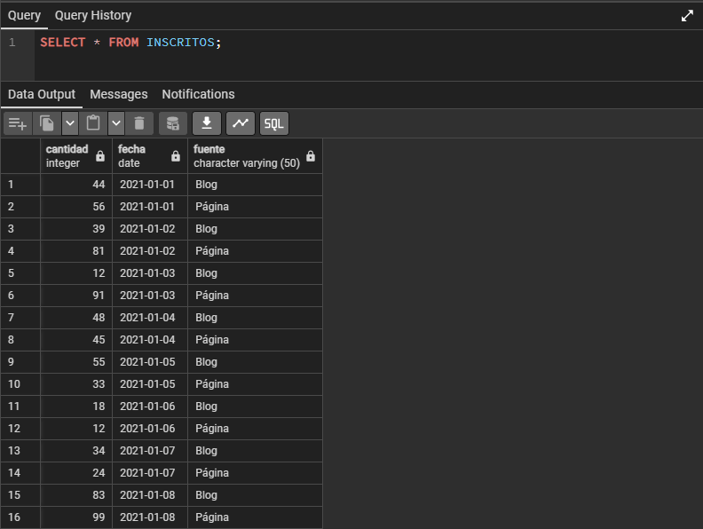
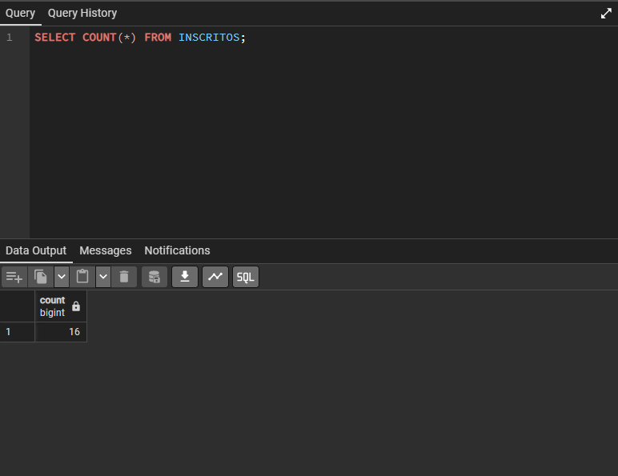
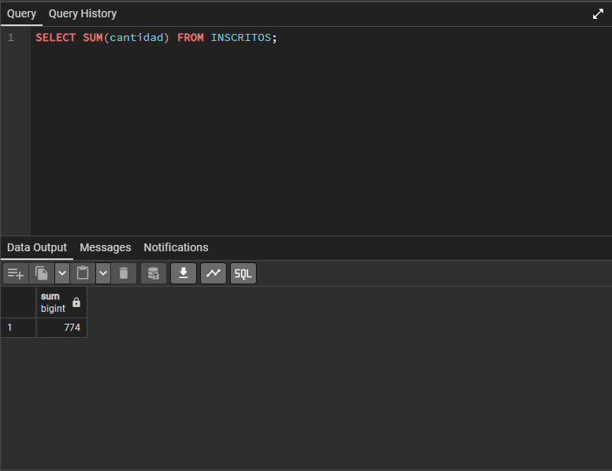
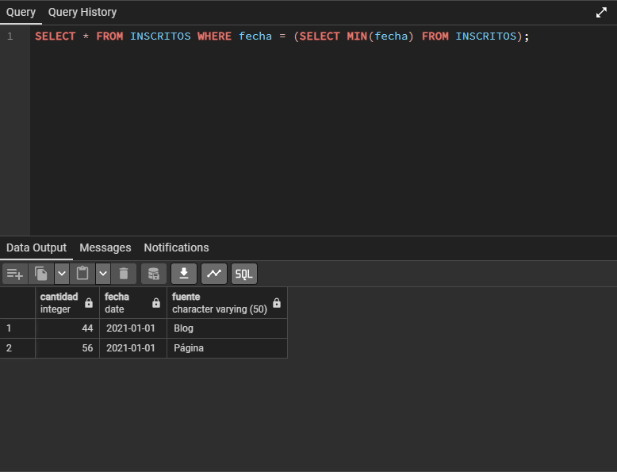
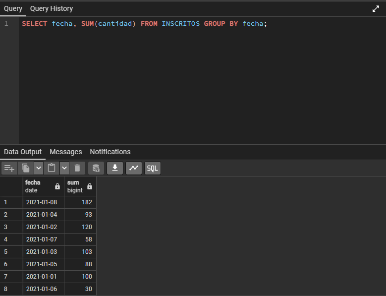
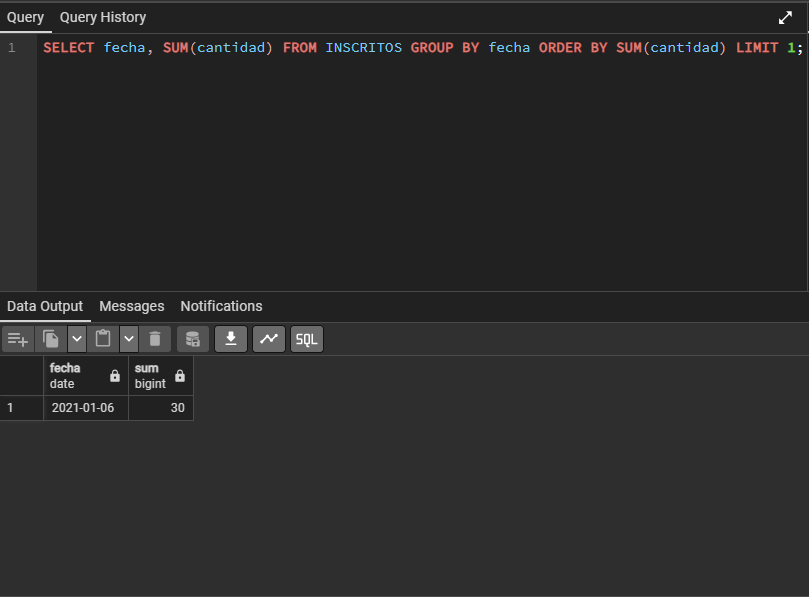
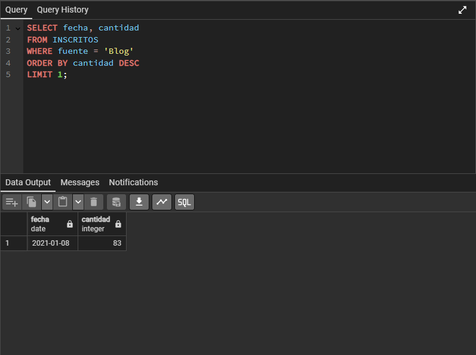
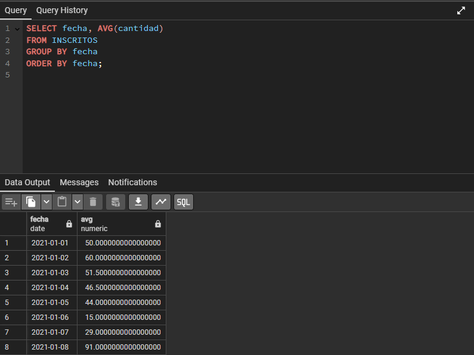
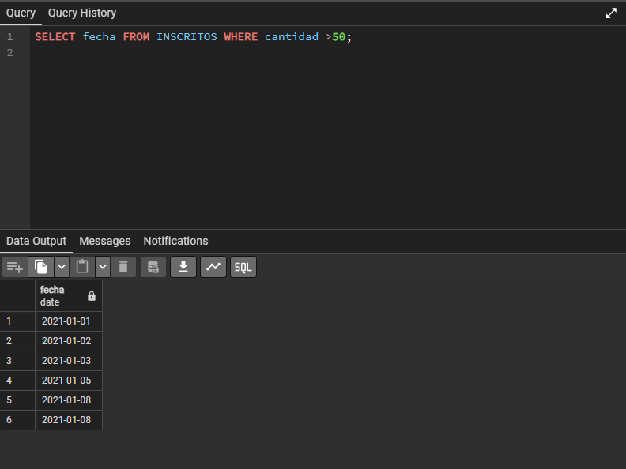
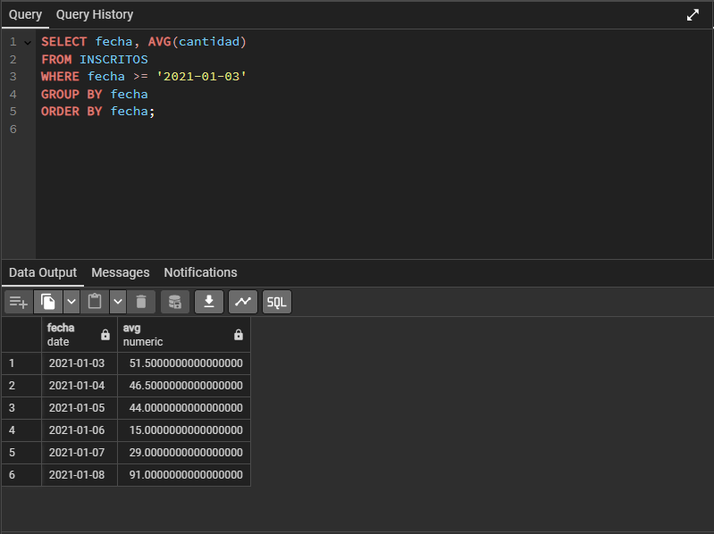

# Modulo-5-Desafío-2

Resolucion desafio 2 del modulo 5 SQL

Requerimientos.

1. ¿Cuántos registros hay?

2. ¿Cuántos inscritos hay en total?

3. ¿Cuál o cuáles son los registros de mayor antigüedad?

4. ¿Cuántos inscritos hay por día? (Indistintamente de la fuente de inscripción)

5. ¿Cuántos inscritos hay por fuente?

6. ¿Qué día se inscribió la mayor cantidad de personas? Y ¿Cuántas personas se
inscribieron en ese día?

7. ¿Qué día se inscribieron la mayor cantidad de personas utilizando el blog? ¿Cuántas
personas fueron? (si hay más de un registro con el máximo de personas, considera
solo el primero)

8. ¿Cuál es el promedio de personas inscritas por día? Toma en consideración que la
base de datos tiene un registro de 8 días, es decir, se obtendrán 8 promedios.

9. ¿Qué días se inscribieron más de 50 personas?

10. ¿Cuál es el promedio por día de personas inscritas?
Considerando sólo calcular desde el tercer día.
